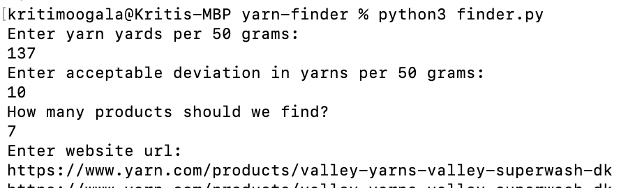
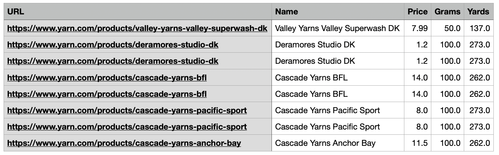

## Web Scraper to Find Yarn 🧶
### Problem:
I love to knit! In the world of knitting, choosing the right yarn is a crucial step in every project. 
One key factor in this selection process is the yarn's thickness, which is often determined by its yardage per gram. However, finding yarn options with a specific weight can be challenging, as it often requires sifting through hundreds of options!

Example of yards per gram:

### Solution:
This project simplifies this process by developing a web scraping tool that aggregates yarn options that match the desired weight (yards/gram). 
By automating the search for yarn, this tool will save time and effort for knitters.
 
The user can enter their yarn specifications, along with a starting URL and the number of entries they want to be returned:

It will return the URLs and details of yarns that match their criteria in a .csv file.

### How it's made:
#### Tech used: Python (BeautifulSoup library)
Using the initial URL from the user, a list of URLs to visit is initialized. Then, the BeautifulSoup library is used to parse the HTML content of each page. The script checks each page for product links, adding unvisited links to the queue. It identifies potential product pages by detecting specific text patterns and calculates the yards per 50 grams of each yarn product encountered. If the calculated value falls within the user's specified range, the script gathers relevant product details, such as the name, price, grams, and yards, and stores them in a list. Finally, the gathered yarn data is exported to a CSV file named yarns.csv.

### Future additions:

For now, this tool is restricted to the website yarn.com, however, I hope to include more sites in the future. I also wish to add a feature to sort the output by unit price or other criteria!
