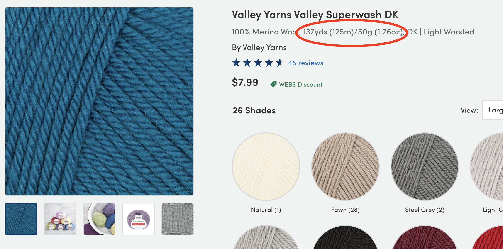

## Web Scraper to Find Yarn 🧶
### Problem:
I love to knit! In the world of knitting, choosing the right yarn is a crucial step in every process. 
One key factor in this selection process is the yarn's thickness, which is often determined by its yardage per gram. However, finding yarn options with a specific weight can be challenging, as it often requires sifting through hundreds of options!

### Solution:
This project simplifies this process by developing a web scraping tool that aggregates yarn options that match the desired weight (yards/gram). 
By automating the search for yarn, this tool will save time and effort for knitters.
 

